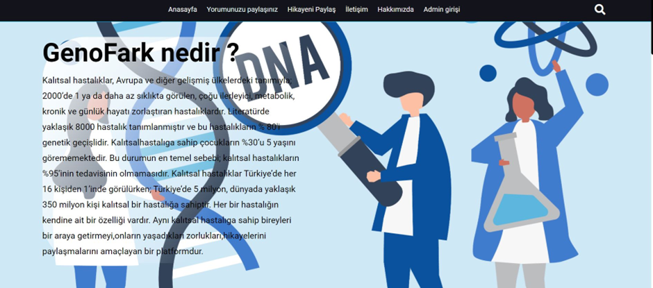
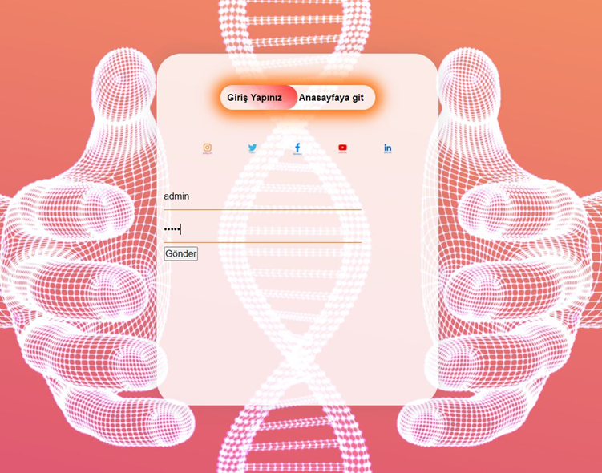
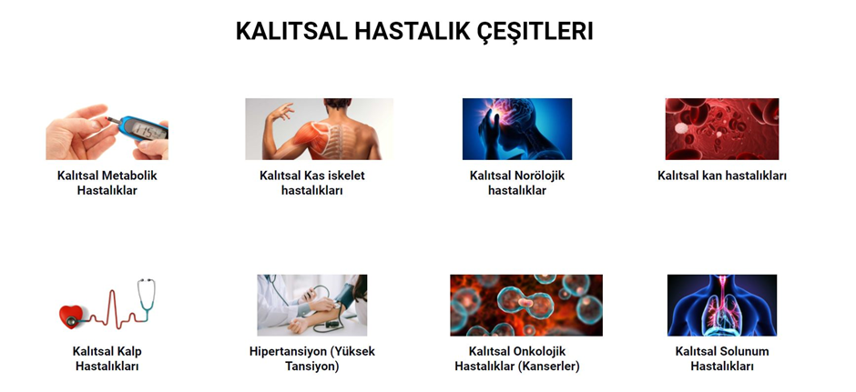
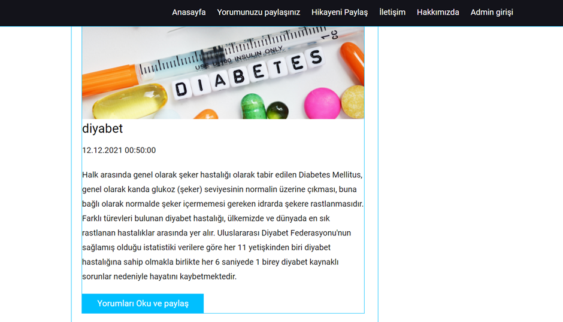
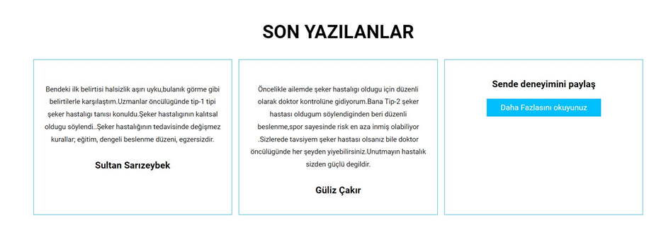
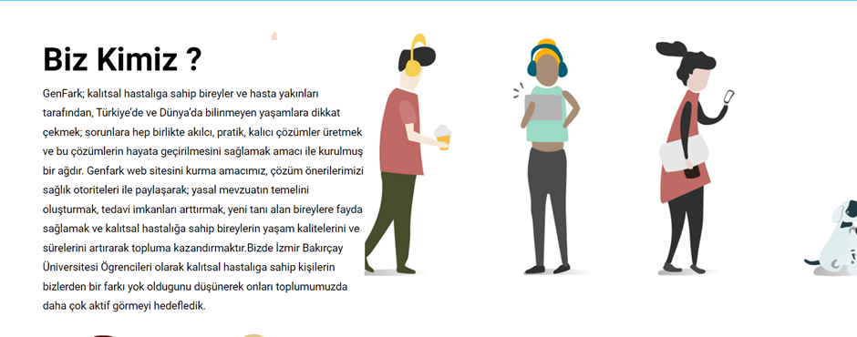
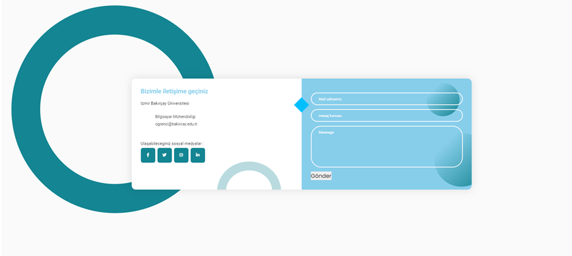
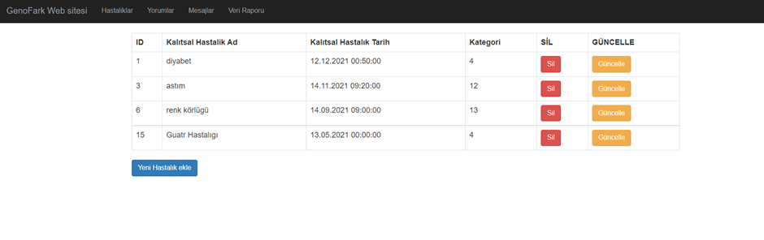
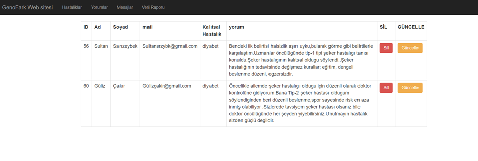
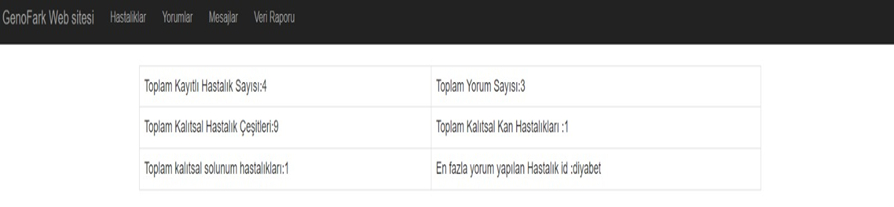

# 🌐 GenoFark: Kalıtsal Hastalık Farkındalık ve Deneyim Paylaşım Platformu

GenoFark, kalıtsal hastalıklar hakkında farkındalık yaratmayı ve bu konuda bilgi paylaşımı yapmayı hedefleyen bir web platformudur. Kullanıcıların bilgiye kolayca erişmelerini, deneyimlerini paylaşmalarını ve birbirlerinden destek alabilmelerini sağlar.

---

## ✨ Özellikler

- **📚 Bilgi ve Farkındalık**: Kalıtsal hastalıklarla ilgili doğrulanmış bilgiler ve rehber niteliğinde yazılar sunar.
- **📝 Deneyim Paylaşımı**: Kullanıcılar hastalıklarıyla ilgili deneyimlerini veya yaşam öykülerini paylaşabilir.
- **📂 Kategorize Edilmiş İçerik**: Hastalık bilgileri ve deneyimler kategorilere ayrılmıştır, böylece kullanıcılar aradıkları bilgiye hızlıca ulaşabilir.
- **🔧 Yönetim Paneli**: Yöneticiler içerik onaylama, güncelleme ve istatistik yönetimi gibi işlemleri kolayca yapabilir.

---

## 👥 Kullanıcı Roller ve İşlevleri

1. **👩‍⚕️ Kalıtsal Hastalık Sahibi Kullanıcılar**:
   - 🖋️ Deneyim paylaşabilir.
   - ✍️ Yaşam öykülerini anlatabilir.
   - 👀 Diğer kullanıcıların deneyimlerini ve bilgilerini okuyabilir.

2. **🔍 Diğer Kullanıcılar**:
   - 📖 Bilgilendirici yazıları okuyabilir.
   - 🌟 Deneyim ve öykülerden faydalanabilir.

3. **🛠️ Yönetici (Admin)**:
   - ✅ Kullanıcı içeriklerini onaylama veya kaldırma.
   - ➕ Yeni kategoriler ve bilgiler ekleme.
   - 📊 İstatistik yönetimi ve raporlama.

---

## 💻 Teknolojiler

- **Frontend**: 🌐 HTML, 🎨 CSS, 📦 Bootstrap, ⚡ JavaScript
- **Backend**: 🖥️ ASP.NET, 🔄 Entity Framework
- **Veritabanı**: 🗄️ Microsoft SQL Server

---

## 🚀 Kurulum

Projeyi çalıştırmak için aşağıdaki adımları izleyin:

1. **📥 Depoyu Klonlayın**:
   ```bash
   git clone <REPO_URL>
   cd GenoFark











